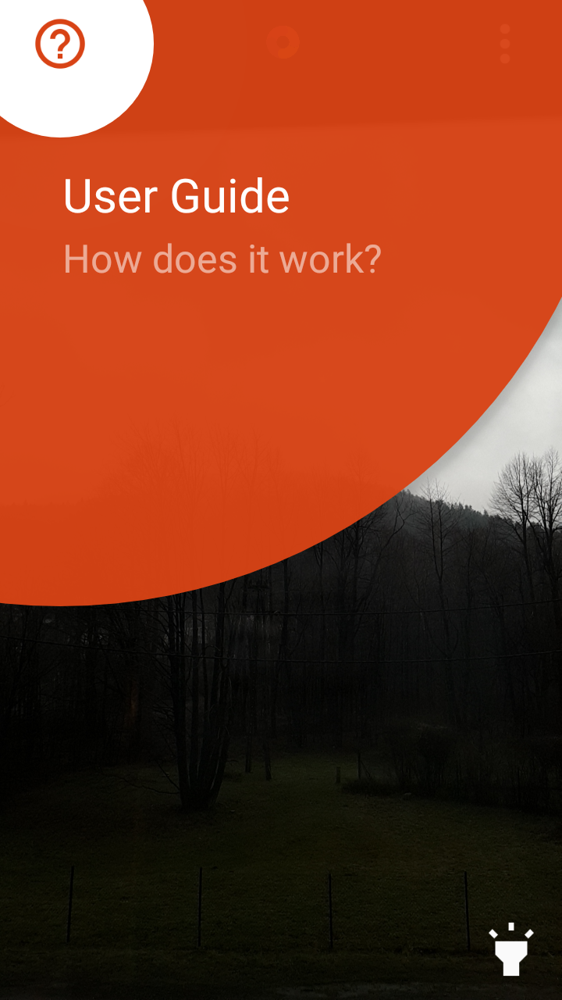
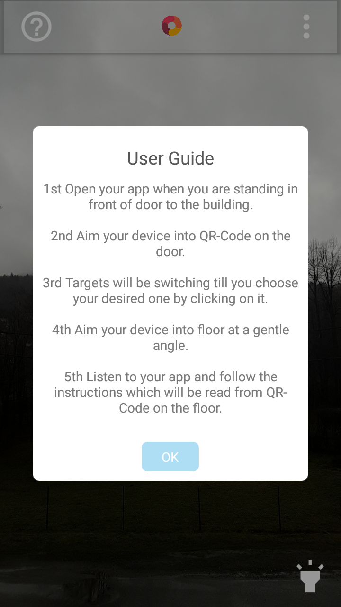
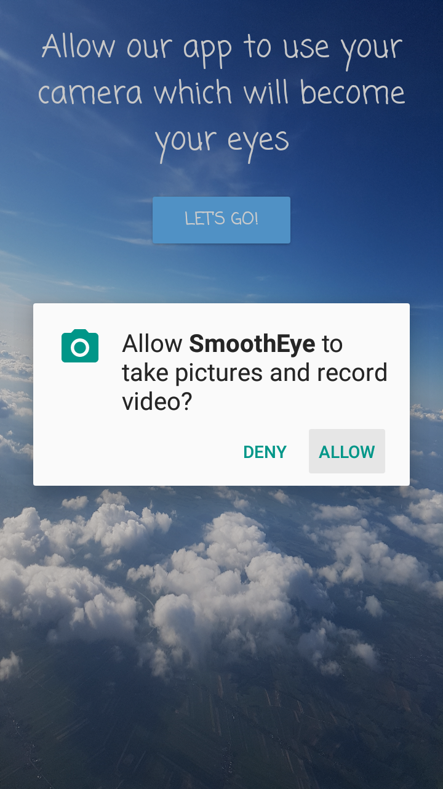
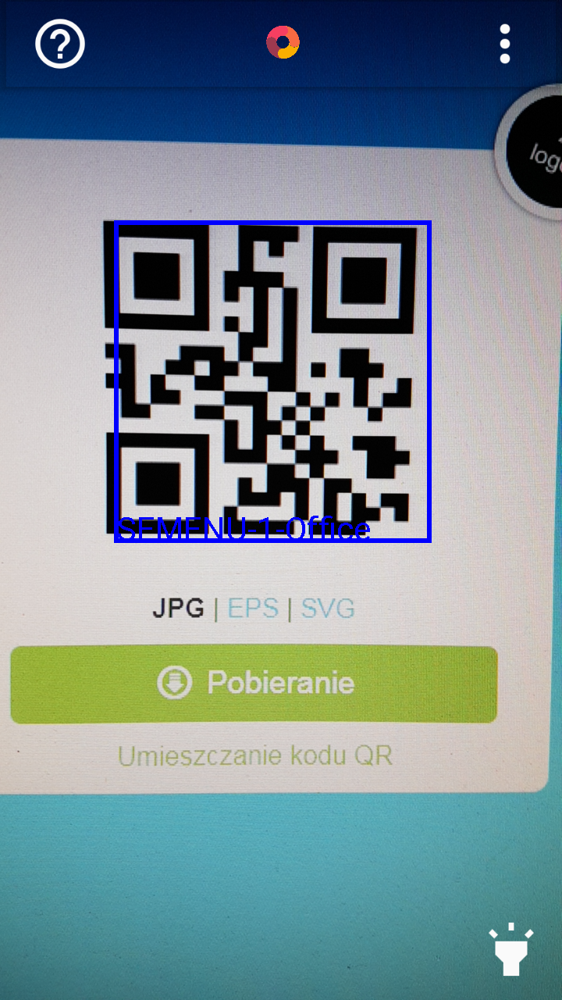

# SmoothEye

The main purpose of the SmoothEye application is to help blind and vision impaired people by creating an e-friendly guide and an online forum where they can express themselves on various topics related to them. The application guides by scanning QR codes.

## Usage:
1) Open your app when you are standing in front of door to the building.
2) Aim your device into QR-Code on the door.
3) Targets will be switching till you choose your desired one by clicking on it.
4) Aim your device into floor at a gentle angle.
5) Listen to your app and follow the instructions which will be read from QR-Code on the floor.

First launch                                         | User guide dialog
:---------------------------------------------------:|:-------------------------------------------------:
 |

Permission screen                                    | QR-Code Detecion
:---------------------------------------------------:|:-------------------------------------------------:
        |

TalkPost threads view                                |
:---------------------------------------------------:|
     |
